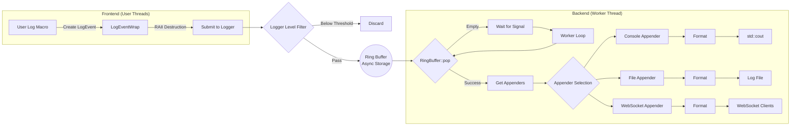

<div align="center">

# Awakelion-Logger

A low-latency, high-throughput and few-dependency logger for `AwakeLion Robot Lab` project. It's highly based on modern C++ standard library (C++20).


[](https://github.com/AwakeLion-Robot-Lab/awakelion-logger/actions/workflows/ci.yml)

English | [简体中文](./docs/README.zh_CN.md)

</div>

---

## Features

### Pipeline



### Structure

* Awakelion-Logger is based on async-logger(MPSC) and sync-appender(SPSC) mode, which is inspired from [log4j2](https://logging.apache.org/log4j/2.12.x/).
* Whole strcuture is based on [sylar-logger](https://github.com/sylar-yin/sylar/blob/master/sylar%2Flog.h), which means that use logger manager singleton class to manage multi-loggers in multi-threads. Besides, modern c++ function is inspired from [minilog](https://github.com/archibate/minilog) and [fmtlib](https://github.com/fmtlib).
* the design of appenders are inspired by `sink` in [spdlog](https://github.com/gabime/spdlog/tree/v1.x/include/spdlog/sinks).
* you can customize your favorite log event in [settings json](./config/aw_logger_settings.json), and it's changable without build each time.

### Core of asynchronous

The core of implementation about asynchronous is **MPMC ringbuffer**, which is lock-free and with mirrored index memory. I take in a lot of reference below:

* Deeply inspired by  [Vyukov&#39;s MPMCQueue](https://www.1024cores.net/home/lock-free-algorithms/queues/bounded-mpmc-queue), which is a better way to adapt MPMC model.
* [kfifo](https://git.kernel.org/pub/scm/linux/kernel/git/stable/linux.git/tree/lib/kfifo.c) for mirrored index memory.
* Use `std::allocator` as standard of memory allocation, like placement new.

> [!NOTE]
> I already found a helpful [blog](https://pskrgag.github.io/post/mpmc_vuykov/) to explain Vyukov's MPMCQueue, and here I provide my thought.

**The core of Vyukov's MPMCQueue is the sequence of each cell**, here cell is the base element of ringbuffer, which includes sequence and input `DataT` data.

In fact, sequence is an atomic counter, according to source code, **it indicates the status of between cell and operator thread**.

#### Key parameters

* `curr_wIdx / curr_rIdx`: **write index / read index in current thread.**
* `curr_seq`: **sequence of current cell in current thread.**

#### How it update

|                 |                  `push()`                  |                          `pop()`                           |
| :-------------: | :----------------------------------------: | :--------------------------------------------------------: |
| **description** | add to `curr_wIdx + 1`, move to next cell. | add to `curr_rIdx + capacity`, move to next mirror memory. |
| **expression**  |         `curr_seq = curr_wIdx + 1`         |             `curr_seq = curr_rIdx + mask_ + 1`             |

#### Constructor

```cpp
buffer_ = allocator_trait::allocate(alloc_, r_capacity);
    for (size_t i = 0; i < r_capacity; i++)
    {
        /* construct empty cell */
        allocator_trait::construct(alloc_, buffer_ + i);
        /* initialize sequence */
        (buffer_ + i)->sequence_.store(i, std::memory_order_relaxed);
    }
```

#### Producer perspective

|     status      |                                                    available                                                     |                             pending                              |                                                                             unavailable                                                                             |
| :-------------: | :--------------------------------------------------------------------------------------------------------------: | :--------------------------------------------------------------: | :-----------------------------------------------------------------------------------------------------------------------------------------------------------------: |
| **description** | default to its index,<br />producer can write.<br />after update, it signal<br />to consumer for `ready` status. | occupied by another producer,<br />wait for write and try again. | this cell already wrap-around(property of unsigned int),<br />but write index not, that means all cells are written,<br /> which also means the ringbuffer is full. |
| **expression**  |                                                  `== curr_wIdx`                                                  |                          `> curr_wIdx`                           |                                                                            `< curr_wIdx`                                                                            |

#### Consumer perspective

|     status      |                                                         available                                                          |                                                   pending                                                   |                                 unavailable                                 |
| :-------------: | :------------------------------------------------------------------------------------------------------------------------: | :---------------------------------------------------------------------------------------------------------: | :-------------------------------------------------------------------------: |
| **description** | equal to value after `push()` update,<br />it means it's time to read,<br />which is similar to `std::condition_variable`. | this cell has already<br />read, try to load <br />`curr_rIdx` status again<br />for a next read operation. | data in all cells have been read,<br />which means the ringbuffer is empty. |
| **expression**  |                                                     `== curr_rIdx + 1`                                                     |                                              `> curr_rIdx + 1`                                              |                              `< curr_rIdx + 1`                              |

## Dependencies

### nlohmann JSON

a flexible and light-weighted JSON C++ library for log pattern customization. It's already inside `include/nlohmann` folder, and its version is `3.12.0`.

### uWebSockets

a light-weighted C++ websocket header-only library for monitoring log information so that you can watch debugs in real time remotely. I will release a web for awakelion-logger logging.

## Installation

> Awakelion-Logger is a header-only library and you can use it directly without building, just include the headers and configure the JSON file.

### Requirements

- C++20 compatible compiler (GCC 10+, Clang 10+, or MSVC 2019+)
- CMake 3.20+ and GoogleTest (only needed for building tests/benchmarks)
- Git for git clone repository and its submodules

### Quick Setup

For most users who just want to use the library:

1. Clone the repository with submodules:

```bash
git clone --recursive https://github.com/AwakeLion-Robot-Lab/awakelion-logger.git
```

Or if you already cloned without `--recursive`:

```bash
git clone https://github.com/AwakeLion-Robot-Lab/awakelion-logger.git
cd awakelion-logger
git submodule update --init --recursive
```

2. Include in your project and configure:

   you can use CMake Subdirectory, which just add as a subdirectory in your CMakeLists.txt:

```cmake
add_subdirectory(path/to/awakelion-logger)
target_link_libraries(your_target PRIVATE aw_logger)
```

Or with CMake FetchContent:

```cmake
include(FetchContent)
FetchContent_Declare(
  aw_logger
  GIT_REPOSITORY https://github.com/AwakeLion-Robot-Lab/awakelion-logger.git
  GIT_TAG main
)
FetchContent_MakeAvailable(aw_logger)
target_link_libraries(your_target PRIVATE aw_logger)
```

with CMake, the library automatically handles include paths and dependencies.

and just make it! Now just include in your C++ files like below:

```cpp
#include "aw_logger/aw_logger.hpp"
```

### Quick Start Example

you can build test file and use command `./hello_aw_logger` to check out quickly, or you can write you first aw_logger file like below:

```cpp
#include "aw_logger/aw_logger.hpp"

int main() {
    auto logger = aw_logger::getLogger();

    AW_LOG_INFO(logger, "Hello aw_logger!");
    AW_LOG_FMT_INFO(logger, "Value: {}", 42);

    return 0;
}
```

### Build Tests/Benchmarks (Optional)

#### CMake Options

- `BUILD_TESTING`: Enable building tests and benchmarks (default: `OFF`)
- `CONFIG_FILE_PATH`: Path to logger configuration file (default: `config/aw_logger_settings.json`), auto-generated in build directory

Only needed if you want to run tests or performance benchmarks:

1. Clone with submodules:

```bash
git clone --recursive https://github.com/AwakeLion-Robot-Lab/awakelion-logger.git
cd awakelion-logger
```

2. Configure and build:

```bash
mkdir build && cd build
cmake .. -DCMAKE_BUILD_TYPE=Release -DBUILD_TESTING=ON
make -j4
```

3. Run tests:

```bash
ctest --output-on-failure
# Or run specific benchmarks
./load_benchmark
```

### Benchmark Stats

#### Performance Benchmarks

Performance tests conducted on the following environment:

- Platform: Linux, VMware Workstation 17pro
- Performance: 4 core CPU(usage < 20%), <1GB avaliable memory
- Test tool: GoogleTest with [custom utilities](./test/utils.hpp)

#### Multi-threaded Performance (Console Output)

|     Metric     |               Value                |
| :------------: | :--------------------------------: |
|    Threads     |                 8                  |
|   Total Logs   |              400,000               |
|    Log Size    | 130-150 bytes(without `file_name`) |
|  Average Time  |        3628.4ms (5 rounds)         |
| **Throughput** |       **~110,000 logs/sec**        |

*Note: log size is includes all the format except for the `file_name`*

## TODO

- [X] support `ComponentFactory` class which is used to manage component registration. @done(25-10-11 23:19)
- [X] support `LoggerManager` singleton class to manager loggers in multi-threads. @done(25-10-11 23:19)
- [ ] support websocket for monitoring log information in real time, considering library as [uWebSockets](https://github.com/uNetworking/uWebSockets). @started(25-10-15 03:33) @high
- [X] process ringbuffer load test and appenders latency test. @started(25-10-11 23:19) @high @done(25-10-18 00:08) @lasted(6d49m31s)
- [ ] support `%` as format specifier in `ComponentFactory` class. @low
- [X] after load test, consider to support double ringbuffer to reduce lock time. @low @done(25-10-18 03:02) [siyiya]: no need for now.
