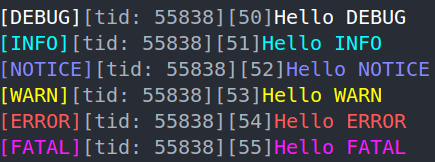
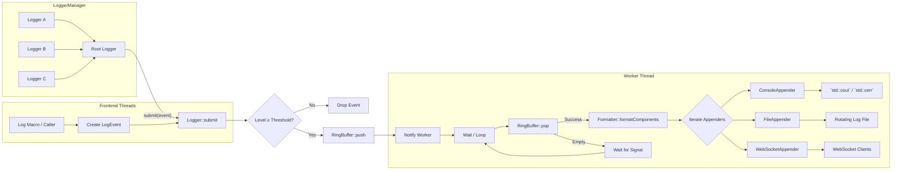

<div align="center">

# Awakelion-Logger

A low-latency, high-throughput and few-dependencies logger for `AwakeLion Robot Lab` project. It's highly based on modern C++ standard library (C++20).



[](https://github.com/AwakeLion-Robot-Lab/awakelion-logger/actions/workflows/ci.yml) [](https://github.com/AwakeLion-Robot-Lab/awakelion-logger/actions/workflows/cpp-linter.yml) [](https://github.com/AwakeLion-Robot-Lab/awakelion-logger/actions/workflows/docs.yml)

English | [简体中文](./docs/README.zh_CN.md)

[github-pages](https://awakelion-robot-lab.github.io/awakelion-logger/) for API docs

</div>

---

## Features

### Pipeline



### Structure

* Awakelion-Logger is based on async-logger(MPSC) and sync-appender(SPSC) mode, which is inspired from [log4j2](https://logging.apache.org/log4j/2.12.x/).
* Whole strcuture is based on [sylar-logger](https://github.com/sylar-yin/sylar/blob/master/sylar%2Flog.h), which means that use logger manager singleton class to manage multi-loggers in multi-threads. Besides, modern c++ function is inspired from [minilog](https://github.com/archibate/minilog) and [fmtlib](https://github.com/fmtlib).
* The design of appenders are inspired by `sink` in [spdlog](https://github.com/gabime/spdlog/tree/v1.x/include/spdlog/sinks).
* You can customize your favorite log event in [settings json](./config/aw_logger_settings.json) and it's changable without build each time, or just custom format in runtime(refer to [hello_aw_logger](./test/hello_aw_logger.cpp)). Also support hundreds of colors [inside](include/aw_logger/fmt_base.hpp).

### Core of asynchronous

The core of implementation about asynchronous is **MPMC ringbuffer**, which is lock-free and with mirrored index memory. I take in a lot of reference below:

* Deeply inspired by  [Vyukov&#39;s MPMCQueue](https://www.1024cores.net/home/lock-free-algorithms/queues/bounded-mpmc-queue), which is a better way to adapt MPMC model.
* [kfifo](https://git.kernel.org/pub/scm/linux/kernel/git/stable/linux.git/tree/lib/kfifo.c) for mirrored index memory.
* Use `std::allocator` as standard of memory allocation, like placement new.

> [!NOTE]
> I already found a helpful [blog](https://pskrgag.github.io/post/mpmc_vuykov/) to explain Vyukov's MPMCQueue, and here I provide my thought.

**The core of Vyukov's MPMCQueue is the sequence of each cell**, here cell is the base element of ringbuffer, which includes sequence and input `DataT` data.

In fact, sequence is an atomic counter, according to source code, **it indicates the status of between cell and operator thread**.

#### Key parameters

* `curr_wIdx / curr_rIdx`: **write index / read index in current thread.**
* `curr_seq`: **sequence of current cell in current thread.**

#### How it update

|                 |                  `push()`                  |                          `pop()`                           |
| :-------------: | :----------------------------------------: | :--------------------------------------------------------: |
| **description** | add to `curr_wIdx + 1`, move to next cell. | add to `curr_rIdx + capacity`, move to next mirror memory. |
| **expression**  |         `curr_seq = curr_wIdx + 1`         |             `curr_seq = curr_rIdx + mask_ + 1`             |

#### Constructor

```cpp
buffer_ = allocator_trait::allocate(alloc_, r_capacity);
    for (size_t i = 0; i < r_capacity; i++)
    {
        /* construct empty cell */
        allocator_trait::construct(alloc_, buffer_ + i);
        /* initialize sequence */
        (buffer_ + i)->sequence_.store(i, std::memory_order_relaxed);
    }
```

#### Producer perspective

|     status      |                                                    available                                                     |                             pending                              |                                                                             unavailable                                                                             |
| :-------------: | :--------------------------------------------------------------------------------------------------------------: | :--------------------------------------------------------------: | :-----------------------------------------------------------------------------------------------------------------------------------------------------------------: |
| **description** | default to its index,<br />producer can write.<br />after update, it signal<br />to consumer for `ready` status. | occupied by another producer,<br />wait for write and try again. | this cell already wrap-around(property of unsigned int),<br />but write index not, that means all cells are written,<br /> which also means the ringbuffer is full. |
| **expression**  |                                                  `== curr_wIdx`                                                  |                          `> curr_wIdx`                           |                                                                            `< curr_wIdx`                                                                            |

#### Consumer perspective

|     status      |                                                         available                                                          |                                                   pending                                                   |                                 unavailable                                 |
| :-------------: | :------------------------------------------------------------------------------------------------------------------------: | :---------------------------------------------------------------------------------------------------------: | :-------------------------------------------------------------------------: |
| **description** | equal to value after `push()` update,<br />it means it's time to read,<br />which is similar to `std::condition_variable`. | this cell has already<br />read, try to load <br />`curr_rIdx` status again<br />for a next read operation. | data in all cells have been read,<br />which means the ringbuffer is empty. |
| **expression**  |                                                     `== curr_rIdx + 1`                                                     |                                              `> curr_rIdx + 1`                                              |                              `< curr_rIdx + 1`                              |

## Dependencies

### nlohmann JSON

A flexible and lightweight JSON C++ library for log pattern customization. Included in `include/3rdparty/nlohmann` (version 3.12.0).

### IXWebSocket

A lightweight C++ WebSocket library for real-time log streaming.

### Protobuf

a lightning-fast serialized message type created by Google.

## Installation

> Awakelion-Logger is a **header-only library**. Simply include the headers and configure the JSON file - no compilation required!

### Requirements

- **C++20 compatible compiler** (GCC 10+, Clang 10+, or MSVC 2019+)
- **[xmake](https://xmake.io/) 2.9.8+** (recommended build system)
- **GoogleTest** (only for tests - auto-downloaded by xmake)

### Quick Setup with xmake

**Why xmake?**
- ✅ **Zero git submodules** - dependencies auto-downloaded
- ✅ **One-line setup** - configure, build, test
- ✅ **Auto package management** - handles IXWebSocket, GoogleTest
- ✅ **Cross-platform** with unified behavior

#### 1. Clone the repository

```bash
git clone https://github.com/AwakeLion-Robot-Lab/awakelion-logger.git
cd awakelion-logger
```

#### 2. Build and test (optional)

```bash
# download requirement
xmake build -y

# build and run tests (optional)
xmake f --test=y -m release -y
xmake test
```

#### For CMake Users

If you prefer CMake, xmake can generate `CMakeLists.txt` for you:

```bash
# generate CMakeLists.txt from xmake.lua
xmake project -k cmakelists

# make and test file
mkdir build && cd build
cmake -DCMAKE_BUILD_TYPE=Release ..
nproc
make -j<nproc-num>
ctest --output-on-failure
```

This approach ensures you always have an up-to-date CMakeLists.txt without manually maintaining two build systems!

And you just make it! Now just include in your C++ files like below:

```cpp
#include "aw_logger/aw_logger.hpp"
```

### Quick Start Example

You can build test file and use command `./hello_aw_logger` to check out quickly, or you can write you first aw_logger file like below:

```cpp
#include "aw_logger/aw_logger.hpp"

int main() {
    auto logger = aw_logger::getLogger();

    AW_LOG_INFO(logger, "Hello aw_logger!");
    AW_LOG_FMT_INFO(logger, "Value: {}", 42);

    return 0;
}
```

#### Custom Pattern Format

You can customize the log output format using pattern strings. Here are the available format specifiers:

| Specifier | Description                                         |
| :-------: | :-------------------------------------------------- |
|   `%t`    | Timestamp                                           |
|   `%p`    | Log level (DEBUG, INFO, WARN, etc.)                 |
|   `%i`    | Thread ID                                           |
|   `%f`    | Source location - file name                         |
|   `%n`    | Source location - function name                     |
|   `%l`    | Source location - line number                       |
|   `%m`    | Log message                                         |
|   text    | Any text not prefixed with `%` will be output as-is |

and example is below:

```cpp
#include "aw_logger/aw_logger.hpp"

int main() {
    // Create custom pattern: [timestamp] <level> message
    auto factory = std::make_shared<aw_logger::ComponentFactory>("[%t] <%p> %m");
    auto formatter = std::make_shared<aw_logger::Formatter>(factory);
    auto appender = std::make_shared<aw_logger::ConsoleAppender>(formatter);

    auto logger = aw_logger::getLogger("custom");
    logger->setAppender(appender);

    AW_LOG_INFO(logger, "Custom format example");
    // Output: [2025-10-29 22:35:38.456244408] <INFO> Custom format example

    return 0;
}
```

You can also configure patterns in JSON (refer to [aw_logger_settings.json](./config/aw_logger_settings.json)) or see more examples in [hello_aw_logger.cpp](./test/hello_aw_logger.cpp).

### Benchmark Stats

Performance tests conducted on the following environment:

- Platform: Linux, VMware Workstation 17pro
- Performance: 4 core CPU(usage < 20%), <1GB avaliable memory
- Test tool: GoogleTest with [custom utilities](./test/utils.hpp)

#### Multi-threaded Performance (Console Output)

|     Metric     |               Value                |
| :------------: | :--------------------------------: |
|    Threads     |                 4                  |
|   Total Logs   |              400,000               |
|    Log Size    | 130-150 bytes(without `file_name`) |
|  Average Time  |        3046.2 ms (5 rounds)        |
| **Throughput** |       **~131,300 logs/sec**        |

*Note: log size is includes all the format except for the `file_name`*

## TODO

- [X] support `ComponentFactory` class which is used to manage component registration. @done(25-10-11 23:19)
- [X] support `LoggerManager` singleton class to manager loggers in multi-threads. @started(25-10-11 23:19) @done(25-10-12 22:35)
- [ ] support websocket for monitoring log information in real time, considering library as [IXWebSocket](https://github.com/machinezone/IXWebSocket.git). @started(25-10-15 03:33) @high
- [X] process ringbuffer load test and appenders latency test. @started(25-10-11 23:19) @high @done(25-10-18 00:08) @lasted(6d49m31s)
- [X] support `%` as format specifier in `ComponentFactory` class. @low @done(25-10-29 22:40)
- [X] after load test, consider to support double ringbuffer to reduce lock time. @low @done(25-10-18 03:02) [siyiya]: no need for now.
