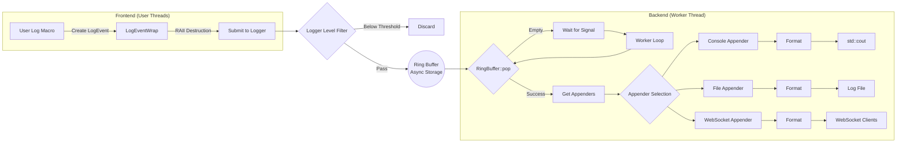

# Awakelion-Logger

A low-latency, high-throughput and few-dependency logger for `AwakeLion Robot Lab` project. It's highly based on modern C++ standard library (C++20).

[](https://github.com/AwakeLion-Robot-Lab/awakelion-logger/actions/workflows/super-linter-cpp.yml)

---

## Features

### Pipeline



### Structure

* Awakelion-Logger is based on async-logger(MPSC) and sync-appender(SPSC) mode, which is inspired from [log4j2](https://logging.apache.org/log4j/2.12.x/).
* Whole strcuture is based on [sylar-logger](https://github.com/sylar-yin/sylar/blob/master/sylar%2Flog.h), which means that use logger manager singleton class to manage multi-loggers in multi-threads. Besides, modern c++ function is inspired from [minilog](https://github.com/archibate/minilog) and [fmtlib](https://github.com/fmtlib).

### Core of asynchronous

* The core of implementation about asynchronous is MPMC ringbuffer, which is lock-free and with mirrored index memory. I take in a lot of reference below:

> * [kfifo](https://git.kernel.org/pub/scm/linux/kernel/git/stable/linux.git/tree/lib/kfifo.c) for mirrored index memory.
> * Deeply inspired by  [Vyukov&#39;s MPMCQueue](https://www.1024cores.net/home/lock-free-algorithms/queues/bounded-mpmc-queue), which is a better way to adapt MPMC model.
> * Use `std::allocator` as standard of memory allocation, like placement new and buffer destruct.

> [!NOTE]
> I already found a helpful [blog](https://pskrgag.github.io/post/mpmc_vuykov/) to explain Vyukov's MPMCQueue, and here I provide my thought.

**The core of Vyukov's MPMCQueue is the sequence of cell**, here cell is the base unit of ringbuffer, which includes sequence and input `DataT` data.

In fact, sequence is an atomic counter, according to source code, **it indicates the status of between cell and operator thread**.

#### Key parameters

* `curr_wIdx / curr_rIdx`: **write index / read index in current thread.**
* `curr_seq`: **sequence of current cell in current thread.**

#### How it update

|                      |                  `push()`                  |                          `pop()`                          |
| :-------------------: | :------------------------------------------: | :----------------------------------------------------------: |
| **description** | add to `curr_wIdx + 1`, move to next cell. | add to `curr_rIdx + capacity`, move to next mirror memory. |
| **expression** |         `curr_seq = curr_wIdx + 1`         |             `curr_seq = curr_rIdx + mask_ + 1`             |

#### Constructor

```cpp
buffer_ = allocator_trait::allocate(alloc_, r_capacity);
    for (size_t i = 0; i < r_capacity; i++)
    {
        /* construct empty cell */
        allocator_trait::construct(alloc_, buffer_ + i);
        /* initialize sequence */
        (buffer_ + i)->sequence_.store(i, std::memory_order_relaxed);
    }
```

#### Producer perspective

|        status        |                                                     available                                                     |                             pending                             |                                                                             unavailable                                                                             |
| :-------------------: | :----------------------------------------------------------------------------------------------------------------: | :--------------------------------------------------------------: | :------------------------------------------------------------------------------------------------------------------------------------------------------------------: |
| **description** | default to its index,<br />producer can write.<br />after update, it signal<br />to consumer for `ready` status. | occupied by another producer,<br />wait for write and try again. | this cell already wrap-around(property of unsigned int),<br />but write index not, that means all cells are written,<br /> which also means the ringbuffer is full. |
| **expression** |                                                  `== curr_wIdx`                                                  |                         `> curr_wIdx`                         |                                                                           `< curr_wIdx`                                                                           |

#### Consumer perspective

|        status        |                             available                             |                                                     pending                                                     |                                 unavailable                                 |
| :-------------------: | :---------------------------------------------------------------: | :-------------------------------------------------------------------------------------------------------------: | :-------------------------------------------------------------------------: |
| **description** | equal to value<br /> after `push()` update,<br />time to read. | this cell has already<br />read, try to load <br />`curr_rIdx` status again<br />for a next read operation. | data in all cells have been read,<br />which means the ringbuffer is empty. |
| **expression** |                       `== curr_rIdx + 1`                       |                                               `> curr_rIdx + 1`                                               |                             `< curr_rIdx + 1`                             |

## Dependencies

### nlohmann JSON

a flexible and light-weighted JSON C++ library for log pattern customization. It's already inside `include/nlohmann` folder.

### uWebSockets

a light-weighted C++ websocket header-only library for monitoring log information so that you can watch debugs in real time remotely.

## Installation

TBD.

## TODO

- [X] support componentFactory class which is used to manage component registration. @done(25-10-11 23:19)
- [X] support loggerManager singleton class to manager loggers in multi-threads. @done(25-10-11 23:19)
- [ ] support websocket for monitoring log information in real time, considering library as [uWebSockets](https://github.com/uNetworking/uWebSockets). @started(25-10-15 03:33) @high
- [ ] process ringbuffer load test and appenders latency test. @started(25-10-11 23:19) @high
- [ ] support `%` as format specifier in formatter class. @low
- [ ] after load test, consider to support double ringbuffer to reduce lock time. @low
