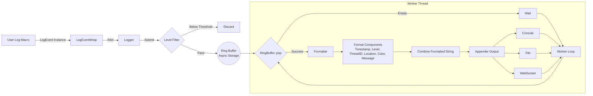

# Awakelion-Logger

a low-latency, high-throughput and few-dependency logger for `AwakeLion Robot Lab` project. It's highly base on modern C++ standard library (C++20).

---

## Features

### Pipeline

### Structure

* Awakelion-Logger is based on async-logger(MPSC) and sync-appender(SPSC) mode, which is inspired from [log4j2](https://logging.apache.org/log4j/2.12.x/).
* whole strcuture is based on [sylar-logger](https://github.com/sylar-yin/sylar/blob/master/sylar%2Flog.h), which means that use logger manager singleton class to manage multi-loggers in multi-threads. besides, modern c++ function is inspired from [minilog](https://github.com/archibate/minilog) and [fmtlib](https://github.com/fmtlib).

### Core of asynchronous

* the core of implementation about asynchronous is ringbuffer, which is lock-free, mirrored index memory and no pow-of-2 limitation. I take up a lot of reference below:

> * [kfifo](https://git.kernel.org/pub/scm/linux/kernel/git/stable/linux.git/tree/lib/kfifo.c) for mirrored index memory.
> * [simple_ringbuffer](https://github.com/bobwenstudy/simple_ringbuffer) for no pow-of-2 limitation.
> * [c++ ringbuffer](https://b23.tv/W79kaS4) for lock-free (atomic manipulation and memory order).
> * also use `std::allocator` as standard of memory allocation, like placement new and buffer destruct.

> [!CAUTION]
> for now, the ringbuffer just for **SPSC in different threads** because CAS operation is too complicate for me :<. However, there is a better way to do it within [Vyukov&#39;s MPMCQueue](https://www.1024cores.net/home/lock-free-algorithms/queues/bounded-mpmc-queue), and I found a helpful [blog](https://int08h.com/post/ode-to-a-vyukov-queue/) to explain it.

## Dependencies

### nlohmann JSON

a flexible and light-weighted JSON C++ library for log pattern customization. It's already inside `include/nlohmann` folder.

### uWebSockets

a light-weighted C++ websocket header-only library for monitoring log information so that you can watch debugs in real time remotely.

## Installation

TBD.

## TODO

- [X] support componentFactory class which is used to manage component registration. @done(25-10-11 23:19)
- [X] support loggerManager singleton class to manager loggers in multi-threads. @done(25-10-11 23:19)
- [ ] process ringbuffer load test and appenders latency test. @started(25-10-11 23:19) @high
- [ ] support `%` as format specifier in formatter class. @started(25-10-12 15:29) @high
- [ ] support websocket for monitoring log information in real time, considering library as [uWebSockets](https://github.com/uNetworking/uWebSockets). @low
- [ ] after load test, consider to support double ringbuffer to reduce lock time. @low
