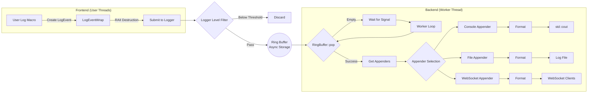

# Awakelion-Logger

一个低延迟、高吞吐量且依赖较少的日志系统，专为 `AwakeLion Robot Lab` 项目设计。它高度基于现代 C++ 标准库 (C++20)。

<div align="center">

[ ](https://github.com/AwakeLion-Robot-Lab/awakelion-logger/actions/workflows/super-linter-cpp.yml)

[English](./README.md) | 简体中文

</div>


---

## 特性

### 流程



### 结构

* Awakelion-Logger 基于 async-logger(MPSC) 和 sync-appender(SPSC) 模式，灵感来源于 [log4j2](https://logging.apache.org/log4j/2.12.x/)。
* 整个结构基于 [sylar-logger](https://github.com/sylar-yin/sylar/blob/master/sylar%2Flog.h)，这意味着使用日志管理器单例类来管理多线程中的多个日志记录器。此外，部分C++函数的实现灵感来源于 [minilog](https://github.com/archibate/minilog) 和 [fmtlib](https://github.com/fmtlib)。
* 附加器（也称作输出器）的设计灵感来自于 [spdlog](https://github.com/gabime/spdlog/tree/v1.x/include/spdlog/sinks) 中的 `sink`。

### 异步核心

异步实现的核心是 **MPMC 环形缓冲区**，它是无锁的，并具有镜像索引内存。以下是我参考的内容：

* 深受 [Vyukov&#39;s MPMCQueue](https://www.1024cores.net/home/lock-free-algorithms/queues/bounded-mpmc-queue) 的启发，这是一个很不赖的MPMC高性能队列。
* [kfifo](https://git.kernel.org/pub/scm/linux/kernel/git/stable/linux.git/tree/lib/kfifo.c) 提供了镜像指示位的思想。
* 使用 `std::allocator` 作为内存分配的标准，比如placement new。

> [!NOTE]
> 我在网上找到个分析Vyukov‘s MPMCQueue的 [blog](https://pskrgag.github.io/post/mpmc_vuykov/)，在本篇README里，我将提供对其浅薄的理解。

**Vyukov 的 MPMCQueue 的核心是每个单元的序列**，这里的单元是环形缓冲区的基本元素，包含序列本身和输入的 `DataT` 数据。

实际上，序列是一个原子计数器，根据源代码，**它指示单元与操作线程之间的状态**。

#### 关键参数

* `curr_wIdx / curr_rIdx`：**当前线程中的写入索引 / 读取索引。**
* `curr_seq`：**当前线程中当前单元的序列。**

#### 它是怎么更新的？

|                  |                  `push()`                  |                        `pop()`                        |
| :--------------: | :------------------------------------------: | :-----------------------------------------------------: |
|  **描述**  | 添加到 `curr_wIdx + 1`，移动到下一个单元。 | 添加到 `curr_rIdx + capacity`，移动到下一个镜像内存。 |
| **表达式** |         `curr_seq = curr_wIdx + 1`         |          `curr_seq = curr_rIdx + mask_ + 1`          |

#### 构造函数里的初始化

```cpp
buffer_ = allocator_trait::allocate(alloc_, r_capacity);
    for (size_t i = 0; i < r_capacity; i++)
    {
        /* construct empty cell */
        allocator_trait::construct(alloc_, buffer_ + i);
        /* initialize sequence */
        (buffer_ + i)->sequence_.store(i, std::memory_order_relaxed);
    }
```

#### 生产者视角

|       状态       |                                              可用                                              |                   待处理                   |                                                         不可用                                                         |
| :--------------: | :---------------------------------------------------------------------------------------------: | :----------------------------------------: | :--------------------------------------------------------------------------------------------------------------------: |
|  **描述**  | 默认使用其索引，<br />生产者可以写入。<br />更新后，它会向<br />消费者发出 `ready` 状态信号。 | 被另一个生产者占用，<br />等待写入并重试。 | 此单元格已环绕（无符号整数的属性），<br />但写入索引没有，这意味着所有单元格都已写入，<br />这也意味着环形缓冲区已满。 |
| **表达式** |                                        `== curr_wIdx`                                        |              `> curr_wIdx`              |                                                    `< curr_wIdx`                                                    |

#### 消费者视角

|       状态       |                                                     可用                                                     |                                          待处理                                          |                            不可用                            |
| :--------------: | :----------------------------------------------------------------------------------------------------------: | :---------------------------------------------------------------------------------------: | :----------------------------------------------------------: |
|  **描述**  | 等于在 `push()` 更新后的值，<br />这说明是时候读取了，<br />这有点像 `std::condition_variable`的工作原理 | 此单元格已被<br />读取，尝试重新加载 <br />`curr_rIdx` 状态<br />以进行下一个读取操作。 | 所有单元格中的数据都已被读取，<br />这意味着环形缓冲区为空。 |
| **表达式** |                                             `== curr_rIdx + 1`                                             |                                    `> curr_rIdx + 1`                                    |                     `< curr_rIdx + 1`                     |

## 依赖

### nlohmann JSON

一个灵活且轻量级的 JSON C++ 库，用于日志模式定制。它已经在 `include/nlohmann` 文件夹里面，版本是 `3.12.0`。

### uWebSockets

一个轻量级的 C++ websocket 头文件库，用于监控日志信息，以便远程实时查看调试信息，后续我会写一个web来监测这个日志系统的log数据。

## 安装

待定。

## 待办事项

- [X] 支持用于管理组件注册的 componentFactory 类。 @done(25-10-11 23:19)
- [X] 支持 loggerManager 单例类以管理多线程中的各个logger。 @done(25-10-11 23:19)
- [ ] 支持 websocket 以实时监控日志信息，考虑使用 [uWebSockets](https://github.com/uNetworking/uWebSockets) 库。 @started(25-10-15 03:33) @high
- [ ] 加上环形缓冲区负载测试和附加器延迟测试。 @started(25-10-11 23:19) @high
- [ ] 在格式化器类中支持 `%` 作为格式说明符的重载。 @low
- [ ] 在负载测试后，考虑支持双环形缓冲区以减少锁定时间。 @low
