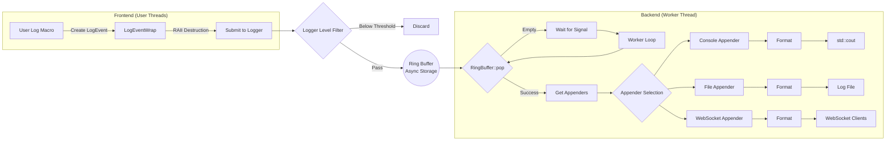

# Awakelion-Logger

一个低延迟、高吞吐量且依赖少的 `AwakeLion Robot Lab` 项目的日志记录器。它高度基于现代 C++ 标准库 (C++20)。


[ ](https://github.com/AwakeLion-Robot-Lab/awakelion-logger/actions/workflows/super-linter-cpp.yml)

[English](./../README.md) | 简体中文

</div>

---

## 特性

### 流程图



### 结构

* Awakelion-Logger 基于 async-logger(MPSC) 和 sync-appender(SPSC) 模式，灵感来源于 [log4j2](https://logging.apache.org/log4j/2.12.x/)。
* 整个结构基于 [sylar-logger](https://github.com/sylar-yin/sylar/blob/master/sylar%2Flog.h)，这意味着使用日志管理器单例类来管理多线程中的多个日志记录器。此外，现代 C++ 函数灵感来源于 [minilog](https://github.com/archibate/minilog) 和 [fmtlib](https://github.com/fmtlib)。
* 附加器的设计灵感来源于 [spdlog](https://github.com/gabime/spdlog/tree/v1.x/include/spdlog/sinks) 中的 `sink`。
* 你可以在 [settings json](./config/aw_logger_settings.json) 中自定义你喜欢的日志事件，并且可以在不重新构建的情况下进行更改。

### 实现异步的核心

异步实现的核心是 **MPMC 环形缓冲区**，它是无锁的，并具有镜像指示位。我参考了很多开源，详见以下links：

* 深受 [Vyukov&#39;s MPMCQueue](https://www.1024cores.net/home/lock-free-algorithms/queues/bounded-mpmc-queue) 的启发，这是适应 MPMC 模型的更好方法。
* [kfifo](https://git.kernel.org/pub/scm/linux/kernel/git/stable/linux.git/tree/lib/kfifo.c) 用于镜像索引内存。
* 使用 `std::allocator` 作为内存分配的标准，例如放置新建。

> [!NOTE]
> I already found a helpful [blog](https://pskrgag.github.io/post/mpmc_vuykov/) to explain Vyukov's MPMCQueue, and here I provide my thought.

**Vyukov 的 MPMCQueue 的核心是每个单元的序列**，这里的单元是环形缓冲区的基本元素，包括序列和输入的 `DataT` 数据。

实际上，序列是一个原子计数器，根据源代码，**它指示单元和操作线程之间的状态**。

#### 关键参数

* `curr_wIdx / curr_rIdx`：**当前线程中的写入索引 / 读取索引。**
* `curr_seq`：**当前线程中当前单元的序列。**

#### 如何更新

|                  |                  `push()`                  |                        `pop()`                        |
| :--------------: | :------------------------------------------: | :-----------------------------------------------------: |
|  **描述**  | 添加到 `curr_wIdx + 1`，移动到下一个单元。 | 添加到 `curr_rIdx + capacity`，移动到下一个镜像内存。 |
| **表达式** |         `curr_seq = curr_wIdx + 1`         |          `curr_seq = curr_rIdx + mask_ + 1`          |

#### 构造函数

```cpp
buffer_ = allocator_trait::allocate(alloc_, r_capacity);
    for (size_t i = 0; i < r_capacity; i++)
    {
        /* construct empty cell */
        allocator_trait::construct(alloc_, buffer_ + i);
        /* initialize sequence */
        (buffer_ + i)->sequence_.store(i, std::memory_order_relaxed);
    }
```

#### 生产者视角

|       状态       |                                              可用                                              |                   待处理                   |                                                        不可用                                                        |
| :--------------: | :---------------------------------------------------------------------------------------------: | :----------------------------------------: | :------------------------------------------------------------------------------------------------------------------: |
|  **描述**  | 默认使用其索引，<br />生产者可以写入。<br />更新后，它会向<br />消费者发出 `ready` 状态信号。 | 被另一个生产者占用，<br />等待写入并重试。 | 此单元已经环绕（无符号整数的属性），<br />但写入索引没有，这意味着所有单元都已写入，<br />这也意味着环形缓冲区已满。 |
| **表达式** |                                        `== curr_wIdx`                                        |              `> curr_wIdx`              |                                                   `< curr_wIdx`                                                   |

#### 消费者视角

|       状态       |                                                       可用                                                       |                                       待处理                                       |                           不可用                           |
| :--------------: | :---------------------------------------------------------------------------------------------------------------: | :---------------------------------------------------------------------------------: | :--------------------------------------------------------: |
|  **描述**  | 等于在 `push()` 更新后的值， <br />这意味着是时候读取了，<br />这有点像 `std::condition_variable`的工作原理。 | 此单元已经被读取，<br />尝试重新加载 `curr_rIdx` 状态<br />以进行下一次读取操作。 | 所有单元中的数据都已被读取，<br />这意味着环形缓冲区为空。 |
| **表达式** |                                               `== curr_rIdx + 1`                                               |                                 `> curr_rIdx + 1`                                 |                    `< curr_rIdx + 1`                    |

## 依赖

### nlohmann JSON

一个灵活且轻量级的 JSON C++ 库，用于本日志系统的参数配置。它已经在 `include/nlohmann` 文件夹里面，版本是 `3.12.0`。

### uWebSockets

一个轻量级的 C++ websocket 头文件库，用于监控日志信息，以便您可以实时远程查看调试信息。我将为 awakelion-logger 日志发布一个网页。

## 安装

> Awakelion-Logger是一个仅包含头文件的库，您无需编译即可直接使用，只需包含头文件并配置JSON文件即可。

### 安装需求

- C++20 兼容的编译器（GCC 10+、Clang 10+ 或 MSVC 2019+）
- CMake 3.20+ 和 GoogleTest（仅在构建测试/基准时需要）
- Git 用于克隆仓库及其子模块

### 快速设置

对于大多数只想使用该库的用户：

1. 使用子模块克隆仓库：

```bash
git clone --recursive https://github.com/AwakeLion-Robot-Lab/awakelion-logger.git
```

    或者你已经克隆本仓库了，但是没克隆子模块：

```bash
git clone https://github.com/AwakeLion-Robot-Lab/awakelion-logger.git
cd awakelion-logger
git submodule update --init --recursive
```

2. 在您的项目中包含并配置：

   你可以使用CMake Subdirectory，在你工作空间的CMakeLists.txt 中添加为子目录：

```cmake
add_subdirectory(path/to/awakelion-logger)
target_link_libraries(your_target PRIVATE aw_logger)
```

    或者使用CMake FetchContent：

```cmake
include(FetchContent)
FetchContent_Declare(
  aw_logger
  GIT_REPOSITORY https://github.com/AwakeLion-Robot-Lab/awakelion-logger.git
  GIT_TAG main
)
FetchContent_MakeAvailable(aw_logger)
target_link_libraries(your_target PRIVATE aw_logger)
```

    使用 CMake，库会自动处理包含路径和依赖关系。

    这样就搞定了，然后只需包含并使用：

```cpp
#include "aw_logger/aw_logger.hpp"
```

### 快速入门示例

您可以构建测试文件并运行 `./hello_aw_logger` 以快速检查，或者您可以像下面这样编写您的第一个 aw_logger 文件：

```cpp
#include "aw_logger/aw_logger.hpp"

int main() {
    auto logger = aw_logger::getLogger();

    AW_LOG_INFO(logger, "Hello aw_logger!");
    AW_LOG_FMT_INFO(logger, "Value: {}", 42);

    return 0;
}
```

### 构建测试/基准测试（可选）

#### CMake 选项

- `BUILD_TESTING`: 启用构建测试和基准测试（default：`ON`）
- `CONFIG_FILE_PATH`: 日志记录配置文件的路径（default：`${ROOT_DIR}/config/aw_logger_settings.json`），就算不传参也OK，因为它在构建目录中自动生成

仅在您想要运行测试或性能基准时需要：

1. 使用子模块克隆：

```bash
git clone --recursive https://github.com/AwakeLion-Robot-Lab/awakelion-logger.git
cd awakelion-logger
```

2. 配置和构建：

```bash
mkdir build && cd build
cmake .. -DCMAKE_BUILD_TYPE=Release -DBUILD_TESTING=ON
make -j4
```

3. 运行测试：

```bash
ctest --output-on-failure
# Or run specific benchmarks
./load_benchmark
```

### 基准测试数据

#### 性能基准

在以下环境中进行的性能测试：

- 平台：Linux，VMware Workstation 17pro（很捞）
- 性能：4 核心 CPU，5.7GB 内存（更捞了）
- 测试工具：使用[自定义工具](./test/utils.hpp)的GoogleTest

#### 多线程性能（控制台输出）

|       指标       |                 值                 |
| :--------------: | :--------------------------------: |
|      线程数      |                 8                 |
|     总日志数     |              400,000              |
|     日志大小     | 130-150 字节（不含 `file_name`） |
|     平均时间     |        3628.4 毫秒（5 轮）        |
| **吞吐量** |    **~110,000 条日志/秒**    |

## TODO

- [X] 支持用于管理组件注册的 `ComponentFactory` 类。 @done(25-10-11 23:19)
- [X] 支持 `LoggerManager` 单例类以在多线程中管理日志记录器。 @done(25-10-11 23:19)
- [ ] 支持 WebSocket 实时监控日志信息，考虑使用 [uWebSockets](https://github.com/uNetworking/uWebSockets) 库。 @started(25-10-15 03:33) @high
- [X] 处理环形缓冲区负载测试和附加器延迟测试。 @started(25-10-11 23:19) @high @done(25-10-18 00:08) @lasted(6d49m31s)
- [ ] 在 `ComponentFactory` 类中支持 `%` 作为格式说明符。 @low
- [X] 在负载测试后，考虑支持双环形缓冲区以减少锁的颗粒度。 @low @done(25-10-18 03:02) [siyiya]: 目前暂时不需要。
