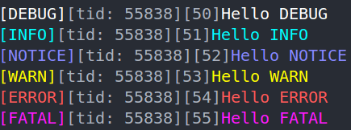
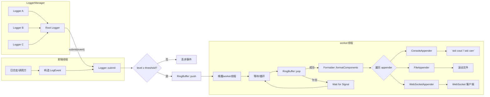

<div align="center">

# Awakelion-Logger

一个低延迟、高吞吐量且依赖少的 `AwakeLion Robot Lab` 项目的日志记录器。它高度基于现代 C++ 标准库 (C++20)。



[](https://github.com/AwakeLion-Robot-Lab/awakelion-logger/actions/workflows/ci.yml) [](https://github.com/AwakeLion-Robot-Lab/awakelion-logger/actions/workflows/cpp-linter.yml) [](https://github.com/AwakeLion-Robot-Lab/awakelion-logger/actions/workflows/docs.yml)

[English](./../README.md) | 简体中文

[github-pages](https://awakelion-robot-lab.github.io/awakelion-logger/)上有相应的API文档

</div>

---

## 特性

### 流程图


```mermaid
flowchart LR
  subgraph LoggerManager["LoggerManager"]
    Root["Root Logger"]
    LoggerA["Logger A"]
    LoggerB["Logger B"]
    LoggerC["Logger C"]

    LoggerA --> Root
    LoggerB --> Root
    LoggerC --> Root
  end

  Root -->|"submit(event)"| Submit[Logger::submit]

  subgraph 前端线程
    Macro[日志宏/调用方] --> Wrap[构造 LogEvent]
    Wrap --> Submit
  end

  Submit --> Filter{level ≥ threshold?}
  Filter -->|否| Drop[丢弃事件]
  Filter -->|是| Enqueue[RingBuffer::push]
  Enqueue --> Notify[唤醒worker线程]

  subgraph 后端线程["worker线程"]
    Notify --> Worker[等待/循环]
    Worker --> Pop[RingBuffer::pop]
    Pop -->|成功| Format[Formatter::formatComponents]
    Pop -->|为空| Wait[Wait for Signal]
    Wait --> Worker

    Format --> AppSel{遍历 appender}
    AppSel --> Console[ConsoleAppender]
    AppSel --> File[FileAppender]
    AppSel --> Web[WebSocketAppender]

    Console --> Stdout[`std::cout`/`std::cerr`]
    File --> LogFile[滚动文件]
    Web --> Clients[WebSocket 客户端]
  end

```

### 结构

* Awakelion-Logger 基于 async-logger(MPSC) 和 sync-appender(SPSC) 模式，灵感来源于 [log4j2](https://logging.apache.org/log4j/2.12.x/)。
* 整个日志框架的设计基于 [sylar-logger](https://github.com/sylar-yin/sylar/blob/master/sylar%2Flog.h)，这意味着使用日志管理器单例类来管理多线程中的多个日志记录器。此外，部分C++函数的实现灵感来源于 [minilog](https://github.com/archibate/minilog) 和 [fmtlib](https://github.com/fmtlib)。
* 附加器（也称作输出器）的设计灵感来自于 [spdlog](https://github.com/gabime/spdlog/tree/v1.x/include/spdlog/sinks) 中的 `sink`。
* 你可以在运行时通过 pattern 字符串自定义日志格式（参考 [hello_aw_logger](./../test/hello_aw_logger.cpp)），并且[内置](./../include/aw_logger/fmt_base.hpp)上百种颜色。

### 实现异步的核心

异步实现的核心是 **MPMC 环形缓冲区**，它是无锁的，并具有镜像指示位。我参考了很多开源，详见以下links：

* 深受 [Vyukov&#39;s MPMCQueue](https://www.1024cores.net/home/lock-free-algorithms/queues/bounded-mpmc-queue) 的启发，这是适应 MPMC 模型的更好方法。
* [kfifo](https://git.kernel.org/pub/scm/linux/kernel/git/stable/linux.git/tree/lib/kfifo.c) 提供了镜像指示位的思想。
* 使用 `std::allocator` 作为内存分配的标准，例如放置新建。

> [!NOTE]
> 我在网上找到个分析Vyukov‘s MPMCQueue的 [blog](https://pskrgag.github.io/post/mpmc_vuykov/)，在本篇README里，我将提供对其浅薄的理解。

**Vyukov 的 MPMCQueue 的核心是每个单元的序列**，这里的单元是环形缓冲区的基本元素，包括序列和输入的 `DataT` 数据。

实际上，序列是一个原子计数器，根据源代码，**它指示单元和操作线程之间的状态**。

#### 关键参数

* `curr_wIdx / curr_rIdx`：**当前线程中的写入索引 / 读取索引。**
* `curr_seq`：**当前线程中当前单元的序列。**

#### 如何更新

|            |                  `push()`                  |                        `pop()`                        |
| :--------: | :----------------------------------------: | :---------------------------------------------------: |
|  **描述**  | 添加到 `curr_wIdx + 1`，移动到下一个单元。 | 添加到 `curr_rIdx + capacity`，移动到下一个镜像内存。 |
| **表达式** |         `curr_seq = curr_wIdx + 1`         |          `curr_seq = curr_rIdx + mask_ + 1`           |

#### 构造函数

```cpp
buffer_ = allocator_trait::allocate(alloc_, r_capacity);
    for (size_t i = 0; i < r_capacity; i++)
    {
        /* construct empty cell */
        allocator_trait::construct(alloc_, buffer_ + i);
        /* initialize sequence */
        (buffer_ + i)->sequence_.store(i, std::memory_order_relaxed);
    }
```

#### 生产者视角

|    状态    |                                             可用                                              |                   待处理                   |                                                        不可用                                                        |
| :--------: | :-------------------------------------------------------------------------------------------: | :----------------------------------------: | :------------------------------------------------------------------------------------------------------------------: |
|  **描述**  | 默认使用其索引，<br />生产者可以写入。<br />更新后，它会向<br />消费者发出 `ready` 状态信号。 | 被另一个生产者占用，<br />等待写入并重试。 | 此单元已经环绕（无符号整数的属性），<br />但写入索引没有，这意味着所有单元都已写入，<br />这也意味着环形缓冲区已满。 |
| **表达式** |                                        `== curr_wIdx`                                         |               `> curr_wIdx`                |                                                    `< curr_wIdx`                                                     |

#### 消费者视角

|    状态    |                                                     可用                                                      |                                      待处理                                       |                           不可用                           |
| :--------: | :-----------------------------------------------------------------------------------------------------------: | :-------------------------------------------------------------------------------: | :--------------------------------------------------------: |
|  **描述**  | 等于在 `push()` 更新后的值， <br />这意味着是时候读取了，<br />这有点像 `std::condition_variable`的工作原理。 | 此单元已经被读取，<br />尝试重新加载 `curr_rIdx` 状态<br />以进行下一次读取操作。 | 所有单元中的数据都已被读取，<br />这意味着环形缓冲区为空。 |
| **表达式** |                                              `== curr_rIdx + 1`                                               |                                 `> curr_rIdx + 1`                                 |                     `< curr_rIdx + 1`                      |

## 依赖

### nlohmann JSON

一个灵活且轻量的 JSON C++ 库，保留用于可选的结构化日志；运行时模式配置不再依赖外部 JSON。已包含在 `include/3rdparty/nlohmann` 目录（版本 3.12.0）。

### IXWebSocket

一个轻量的 C++ WebSocket 库，用于实时日志流传输。

## 安装

> Awakelion-Logger 是一个 **header-only 库**。只需包含头文件并在代码中设置输出 pattern，无需外部配置文件。

### 安装需求

- gcc 13+
- [xmake](https://xmake.io/zh-cn/) 2.9.8+

### 使用xmake快速设置

本项目通过 `xmake` 构建，并通过 `xrepo` 管理。

#### 对于 xmake 直接用户（推荐）
你可以通过命令 `xmake install awakelion-logger` 安装到你的项目中，或者在你的项目的 `xmake.lua` 中进行内置集成，如下所示：
```bash
-- ...exist codes
add_repositories("awakelion-xmake-repo https://github.com/AwakeLion-Robot-Lab/awakelion-xmake-repo.git")
add_requires("awakelion-logger")
```

#### 对于 xmake 源码开发者

```bash
git clone https://github.com/AwakeLion-Robot-Lab/awakelion-logger.git
cd awakelion-logger

# 下载依赖
sudo apt install -y libssl-dev
xmake build -y

# 构建并运行测试（可选）
xmake f --test=y -m release -y
xmake test
```

#### CMake 用户

如果你更喜欢 CMake，只需按照预构建的 `CMakeLists.txt` 中的常规方式进行操作：

```bash
# 编译以及测试
mkdir build && cd build
cmake -DCMAKE_BUILD_TYPE=Release ..
nproc
make -j<nproc-num>
ctest --output-on-failure
```

> [!NOTE]
> 你可以通过 xmake 命令 `xmake project -k cmakelists` 自动更新 `CMakeLists.txt`。

现在你已经完成了！只需在你的 C++ 文件中包含如下内容：

```cpp
#include "aw_logger/aw_logger.hpp"
```

### 快速入门示例

你可以从以下代码从零开始使用：

```cpp
#include "aw_logger/aw_logger.hpp"

int main() {
    auto logger = aw_logger::getLogger("hello_aw_logger");

    AW_LOG_INFO(logger, "Hello aw_logger!");
    AW_LOG_FMT_INFO(logger, "Value: {}", 42);

    return 0;
}
```

### 日志溢出策略

两参数 `Logger` 构造函数保持默认的有界、非阻塞 `drop_new` 行为（normal 队列容量 256，critical 队列容量 64）。如果需要不同的背压策略，可以使用 options 重载：

```cpp
aw_logger::Logger::Options options;
options.normal_policy = aw_logger::Logger::Policy::block;
options.critical_policy = aw_logger::Logger::Policy::overrun_oldest;

auto logger = std::make_shared<aw_logger::Logger>(
    "service",
    aw_logger::LogLevel::level::DEBUG,
    options
);
logger->setAppender(std::make_shared<aw_logger::ConsoleAppender>());
```

`drop_new` 在队列满时拒绝新事件；`block` 等待队列出现空槽，适合可以接受 producer 背压的场景；`overrun_oldest` 接收新事件并丢弃队列中最旧的事件。策略在 logger 构造时固定；如果需要运行时切换，应使用不同 logger 或在外层做路由。`flush()` 会等待已接收以及已明确记账的覆盖事件到达终态。同一个 logger 的 appender 回调中不能使用 `block` 策略再次提交；实现会拒绝这种递归调用，避免 worker 等待自身。

Logger 析构时会排空待处理事件并 join worker。在该 logger 自己的 appender回调中调用`flush()` 会立即返回，调用 `stop()` 会被拒绝。最后一个 `Logger` 所有者必须在外部线程释放，不能在回调中释放；回调无法 join 正在执行它的 worker，因此实现会拒绝这条无效的生命周期路径。

#### 颜色控制

颜色在 formatter 中预先设定，可为不同级别自定义或关闭：

```cpp
auto factory = std::make_unique<aw_logger::ComponentFactory>();
auto formatter = std::make_unique<aw_logger::Formatter>(std::move(factory));
formatter->setLevelColor(aw_logger::LogLevel::level::INFO, "cyan");
formatter->setLevelColor(aw_logger::LogLevel::level::WARN, "orange");
formatter->setDebugColor("violet");

auto console_appender = std::make_shared<aw_logger::ConsoleAppender>(std::move(formatter));
console_appender->enableColor(true);

auto logger = aw_logger::getLogger("colorful");
logger->setAppender(console_appender);

AW_LOG_INFO(logger, "INFO 显示为 cyan");
AW_LOG_WARN(logger, "WARN 显示为 orange");
AW_LOG_DEBUG(logger, "DEBUG 显示为 violet");

auto file_appender = std::make_shared<aw_logger::FileAppender>("logs/app.log");
file_appender->enableColor(false);
```

#### 自定义 Pattern 格式

你可以使用 pattern 字符串自定义日志输出格式。以下是可用的格式说明符：

|  格式符  | 描述                                  |
| :------: | :------------------------------------ |
|   `%t`   | 时间戳                                |
|   `%p`   | 日志级别（DEBUG、INFO、WARN 等）      |
|   `%i`   | 线程 ID                               |
|   `%f`   | 源位置 - 文件名                       |
|   `%n`   | 源位置 - 函数名                       |
|   `%l`   | 源位置 - 行号                         |
|   `%m`   | 日志消息                              |
| 普通文本 | 任何不以 `%` 开头的文本都将按原样输出 |

示例如下：

```cpp
#include "aw_logger/aw_logger.hpp"

int main() {
    // 创建自定义模式：[时间戳] <级别> 消息
    auto factory = std::make_shared<aw_logger::ComponentFactory>("[%t] <%p> %m");
    auto formatter = std::make_shared<aw_logger::Formatter>(factory);
    auto appender = std::make_shared<aw_logger::ConsoleAppender>(formatter);

    auto logger = aw_logger::getLogger("custom");
    logger->setAppender(appender);

    AW_LOG_INFO(logger, "自定义格式示例");
    // 输出：[2025-10-29 22:35:38.456244408] <INFO> 自定义格式示例

    return 0;
}
```

你可以直接在代码中设置或切换输出模式（参见 [hello_aw_logger.cpp](./../test/hello_aw_logger.cpp) 示例）。

### 基准测试数据

在以下环境中进行的性能测试：

- 平台：Linux，VMware Workstation 17pro（很捞）
- 性能：4 核心 CPU（实际上最多跑了20%），<1GB的可用内存（更捞了）
- 测试工具：使用[自定义工具](./../test/utils.hpp)的GoogleTest

#### 多线程性能（控制台输出）

下面数据为 `BenchmarkLogger.MultiThreadedLogging` 在 Release 模式运行 5 次的中位数，stdout重定向到 `/dev/null`。

|    指标    |                值                |
| :--------: | :------------------------------: |
|   线程数   |                8                 |
|  总日志数  |       50,000 * 8 = 400,000       |
|  日志大小  | 130-150 字节（不含 `file_name`） |
|  中位时间  |        488.1 毫秒（5 轮）        |
| **吞吐量** |     **~819k 次 offered/秒**      |

*注意：基准测试除了 `file_name` 外，其余组件全部格式化。当前默认 `drop_new` 策略下，这里统计的是 offered 调用速率而不是实际送达日志速率；送达率请参考下面的溢出策略基线。*

#### 溢出策略基线（Release，ARM64）

下面数据为固定 CPU 0 后运行 5 次的中位数。每次提供 100,000 条格式化 INFO 日志，使用默认队列容量（normal 256、critical 64），并将 stdout 重定向到 `/dev/null`。时间依次为 producer、flush 排空和端到端耗时。

| 策略             | Producer 平均 / P99 | Producer 吞吐 |       送达数（范围） | 未送达 | Producer / 排空 / 端到端 |
| :--------------- | ------------------: | ------------: | -------------------: | -----: | -----------------------: |
| `drop_new`       |   1.23 us / 17.5 us |    811k 次/秒 | 5,510（5,237-5,580） | 94,490 |  131.0 / 0.84 / 131.8 ms |
| `block`          |   8.61 us / 11.0 us |    116k 次/秒 |              100,000 |      0 |  868.3 / 1.91 / 870.4 ms |
| `overrun_oldest` |   2.19 us / 18.4 us |    457k 次/秒 | 9,365（9,311-9,875） | 90,635 |  226.5 / 0.87 / 227.4 ms |

best-effort 策略用送达率换取 producer 延迟：`drop_new` 拒绝新事件，`overrun_oldest` 通过覆盖队列中的旧事件保留更新内容。本轮 `block` 送达了全部 offered 事件，但 producer 会承受背压。

负载 benchmark 会在相同 offered load 下比较三种溢出策略，并分别报告 producer-only、flush-only 排空时间，以及从 producer 开始到排空完成的端到端时间。overflow benchmark 输出提供数量和 appender 实际观测的送达数量，因此 `offered - delivered` 就是本次运行可观察到的丢失量。使用 best-effort 策略时，producer 调用速率不能直接当作实际送达日志速率。

#### `Valgrind`内存泄漏测试

`hello_aw_logger`的测试报告：

```bash
==53296== Memcheck, a memory error detector
==53296== Copyright (C) 2002-2017, and GNU GPL'd, by Julian Seward et al.
==53296== Using Valgrind-3.18.1 and LibVEX; rerun with -h for copyright info
==53296== Command: ./build/linux/arm64/debug/fosu-awakelion/awakelion-logger-test-hello_aw_logger
==53296== Parent PID: 21910
==53296==
==53296== Warning: invalid file descriptor -1 in syscall read()
==53296== Warning: invalid file descriptor -1 in syscall read()
==53296==
==53296== HEAP SUMMARY:
==53296==     in use at exit: 0 bytes in 0 blocks
==53296==   total heap usage: 66,936 allocs, 66,936 frees, 6,521,737 bytes allocated
==53296==
==53296== All heap blocks were freed -- no leaks are possible
==53296==
==53296== For lists of detected and suppressed errors, rerun with: -s
==53296== ERROR SUMMARY: 0 errors from 0 contexts (suppressed: 0 from 0)
```

`load_benchmark`的测试报告：

```bash
==61077== Memcheck, a memory error detector
==61077== Copyright (C) 2002-2017, and GNU GPL'd, by Julian Seward et al.
==61077== Using Valgrind-3.18.1 and LibVEX; rerun with -h for copyright info
==61077== Command: ./build/linux/arm64/debug/fosu-awakelion/awakelion-logger-test-load_benchmark
==61077== Parent PID: 21910
==61077==
==61077==
==61077== HEAP SUMMARY:
==61077==     in use at exit: 0 bytes in 0 blocks
==61077==   total heap usage: 2,345,651 allocs, 2,345,651 frees, 243,733,771 bytes allocated
==61077==
==61077== All heap blocks were freed -- no leaks are possible
==61077==
==61077== For lists of detected and suppressed errors, rerun with: -s
==61077== ERROR SUMMARY: 0 errors from 0 contexts (suppressed: 0 from 0)
```

嗯......这看起来确实没有内存泄漏，如果你的测试结果跟我的不一样，请发PR,有时间的话我会修改的！

## TODO

- [X] 支持用于管理组件注册的 `ComponentFactory` 类。 @done(25-10-11 23:19)
- [X] 支持 `LoggerManager` 单例类以在多线程中管理日志记录器。 @started(25-10-11 23:19) @done(25-10-12 22:35)
- [X] 支持 WebSocket 实时监控日志信息，考虑使用 [IXWebSocket](https://github.com/machinezone/IXWebSocket)。 @started(25-10-15 03:33) @high @done(25-11-21 23:59) @lasted(5w2d20h26m48s)
- [X] 处理环形缓冲区负载测试和附加器延迟测试。 @started(25-10-11 23:19) @high @done(25-10-18 00:08) @lasted(6d49m31s)
- [X] 在 `ComponentFactory` 类中支持 `%` 作为格式说明符。 @low @done(25-10-29 22:40)
- [X] 在负载测试后，考虑支持双环形缓冲区以减少锁的颗粒度。 @low @done(25-10-18 03:02) [siyiya]: 目前暂时不需要。
- [X] 支持 C++ 服务器的格式化器，包括上传 ANSI 颜色和格式解析，就像 `Formatter` 类一样。 @low @done(25-11-23 20:33)
